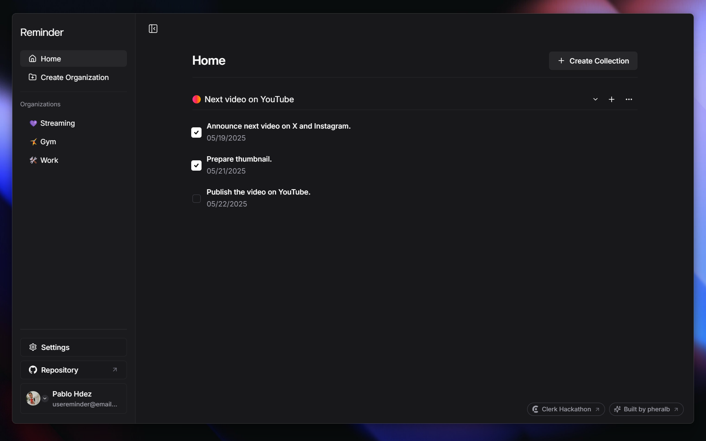

<div align="center">

<a href="https://reminder.pheralb.dev">
    
</a>

<p></p>

<a href="https://reminder.pheralb.dev">Explore</a>
<span>&nbsp;&nbsp;❖&nbsp;&nbsp;</span>
<a href="#-roadmap">Roadmap</a>
<span>&nbsp;&nbsp;❖&nbsp;&nbsp;</span>
<a href="#-getting-started">Contribute/Self Hosted</a>
<span>&nbsp;&nbsp;❖&nbsp;&nbsp;</span>
<a href="https://github.com/pheralb/reminder/issues/new/choose">Create issue</a>
<span>&nbsp;&nbsp;❖&nbsp;&nbsp;</span>
<a href="https://twitter.com/pheralb_">X/Twitter</a>

</div>

## ✨ Introduction

[**Reminder**](https://reminder.pheralb.dev) is a minimalist and intuitive to-do list app that helps you stay organized without distractions. Easily create organizations, group tasks into collections, and set reminders — all for **free**.

Designed with a clean and minimal interface and a smart structure, Reminder is perfect for creators, professionals, and anyone looking to get things done.

## 🚀 Getting Started

To run this project locally, follow these steps:

1. Clone or [**fork**](https://github.com/pheralb/reminder/fork) the repository:

```bash
git clone git@github.com:pheralb/reminder.git
```

2. Navigate to the project directory:

```bash
cd reminder
```

3. Install the dependencies:

```bash
# Install pnpm if you don't have it:
npm install -g pnpm

# Install the dependencies:
pnpm install
```

4. Create a `.env` file in the root directory and add your environment variables:

- `DATABASE_URL`: Your **PostgreSQL** database URL. You can use [Railway](https://railway.app/) or [Neon](https://neon.tech/) to create a free PostgreSQL database.
- `CLERK_SECRET_KEY` & `NEXT_PUBLIC_CLERK_PUBLISHABLE_KEY`: Your Clerk secret key. You can create a free account on [Clerk](https://clerk.dev/) and get your secret key from the dashboard.
- `NEXT_PUBLIC_CLERK_**_URL`: The URL to redirect users after sign-in and sign-up.

```bash
# DATABASE URL:
DATABASE_URL=""

# CLERK:
CLERK_SECRET_KEY=
NEXT_PUBLIC_CLERK_PUBLISHABLE_KEY=
NEXT_PUBLIC_CLERK_SIGN_IN_URL=
NEXT_PUBLIC_CLERK_SIGN_IN_FALLBACK_REDIRECT_URL=
NEXT_PUBLIC_CLERK_SIGN_UP_FALLBACK_REDIRECT_URL=
```

5. Push the `reminder_` tables to your database:

```bash
pnpm db push
```

6. Start the development server:

```bash
pnpm dev
```

Ready 🚀

## 🔭 Roadmap

**Global**

- [ ] Improve UI/UX for mobile devices (working).
- [ ] Improve Metadata, add OG Image (working).

**Organizations**

- [x] Get a list of organizations.
- [x] Insert a new organization.
- [x] Delete an organization.
- [x] Update an organization.
- [x] Go to organization page.

**Collections**

- [x] Get a list of collections.
- [x] Insert a new collection.
- [x] Delete a collection.
- [x] Update a collection.

**Reminders**

- [x] Get a list of reminders in a collection.
- [x] Insert a new reminders in a collection.
- [x] Update an reminders in a collection.

## 📦 Stack

This project is built with the [**T3 Stack**](https://create.t3.gg/) and uses the following technologies:

- [Next.js](https://nextjs.org/) - The React framework for production.
- [Clerk](https://clerk.dev/) - Authentication and user management.
- [Drizzle](https://orm.drizzle.team/) - TypeScript ORM for PostgreSQL.
- [PostgreSQL](https://www.postgresql.org/) - The world's most advanced open source relational database.
- [Tailwind CSS](https://tailwindcss.com/) - A utility-first CSS framework for rapid UI development.
- [shadcn/ui](https://ui.shadcn.com/) - A set of components built with Tailwind CSS and Radix UI.
- [Tanstack Query](https://tanstack.com/query/v4) - A powerful data-fetching library for React.
- [Zod](https://zod.dev/) - A TypeScript-first schema declaration and validation library.

## 📜 License

This project is licensed under the [MIT License](https://github.com/pheralb/reminder/blob/main/LICENSE).